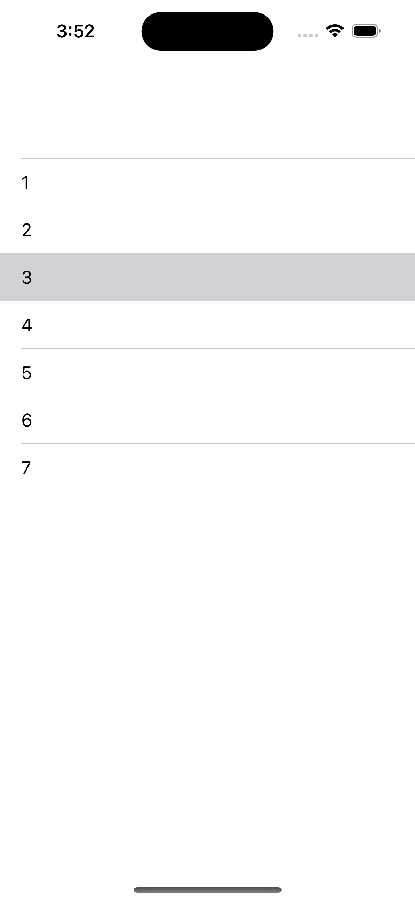
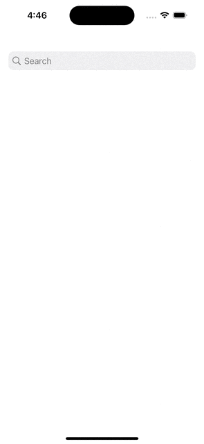

# 📝 배운 내용

## RxSwift로 TableView 구현하기


```swift
import UIKit
import RxSwift
import RxCocoa

class ViewController: UIViewController {
    
    let tableview = UITableView()
    
    let items = Observable.just(["1", "2", "3", "4", "5", "6", "7"])
    var disposeBag = DisposeBag()

    override func viewDidLoad() {
        super.viewDidLoad()
        view.backgroundColor = .systemBackground
        setTableview()
        
        // cell
        items.bind(to: tableview.rx.items) { (tableview , row, element) in
            let cell = tableview.dequeueReusableCell(withIdentifier: "cell")!
            cell.textLabel?.text = element
            return cell
        }.disposed(by: disposeBag)
        
        // cell 클릭
        tableview.rx.itemSelected
            .subscribe { [weak self] indexPath in
                print("\(indexPath)")
            }.disposed(by: disposeBag)
    }
    
    private func setTableview() {
        view.addSubview(tableview)
        tableview.translatesAutoresizingMaskIntoConstraints = false
        tableview.register(UITableViewCell.self, forCellReuseIdentifier: "cell")
        
        NSLayoutConstraint.activate([
            tableview.topAnchor.constraint(equalTo: view.safeAreaLayoutGuide.topAnchor),
            tableview.leadingAnchor.constraint(equalTo: view.safeAreaLayoutGuide.leadingAnchor),
            tableview.trailingAnchor.constraint(equalTo: view.safeAreaLayoutGuide.trailingAnchor),
            tableview.bottomAnchor.constraint(equalTo: view.safeAreaLayoutGuide.bottomAnchor),
        ])
    }

}
```



<br/>

## 서치바 입력시 문자열을 쪼개서 각 cell에 출력하게 구현


```swift
import UIKit
import RxSwift
import RxCocoa
import ReactorKit

class GithubSearchViewController: UIViewController, View {
    
    let tableview = UITableView()
    let searchController = UISearchController(searchResultsController: nil)
    
    var disposeBag = DisposeBag()

    override func viewDidLoad() {
        super.viewDidLoad()
        view.backgroundColor = .systemBackground
        setTableview()
//        self.navigationItem.hidesSearchBarWhenScrolling = false
        navigationItem.searchController = searchController
    }
    
    private func setTableview() {
        view.addSubview(tableview)
        tableview.translatesAutoresizingMaskIntoConstraints = false
        tableview.register(UITableViewCell.self, forCellReuseIdentifier: "cell")
        
        NSLayoutConstraint.activate([
            tableview.topAnchor.constraint(equalTo: view.safeAreaLayoutGuide.topAnchor),
            tableview.leadingAnchor.constraint(equalTo: view.safeAreaLayoutGuide.leadingAnchor),
            tableview.trailingAnchor.constraint(equalTo: view.safeAreaLayoutGuide.trailingAnchor),
            tableview.bottomAnchor.constraint(equalTo: view.safeAreaLayoutGuide.bottomAnchor),
        ])
    }
    
    func bind(reactor: GithubSearchReactor) {
        // Action
        searchController.searchBar.rx.text
            .map { Reactor.Action.updateQuery($0) }
            .bind(to: reactor.action)
            .disposed(by: disposeBag)
        
        // State
        reactor.state
            .map { $0.repos }
            .bind(to: tableview.rx.items(cellIdentifier: "cell")) { (indexPath, repo, cell) in
                cell.textLabel?.text = repo
            }
            .disposed(by: disposeBag)
        
    }
}
```

<br/>


```swift
import Foundation
import ReactorKit

class GithubSearchReactor: Reactor {
    enum Action {
        case updateQuery(String?)
    }
    
    enum Mutation {
        case setRepos([String])
    }
    
    struct State {
        var repos: [String] = []
    }
    
    var initialState = State()
    
    func mutate(action: Action) -> Observable<Mutation> {
        switch action {
        case let .updateQuery(query):
            if let query = query {
                let array = Array(query).map { String($0) }
                return Observable.just(Mutation.setRepos(array))
            } else {
                return Observable.just(Mutation.setRepos([]))
            }
        }
    }
    
    func reduce(state: State, mutation: Mutation) -> State {
        switch mutation {
        case let .setRepos(repos):
            var newState = state
            newState.repos = repos
            return newState
        }
    }
}
```



<br/>

<br/>

<br/>

# 🤔 고민한 점

<br/>

# ⚒️ 트러블 슈팅

<br/>

# 📚 참고 자료

## Xcode 14에서 스토리 보드 지우기

[https://medium.com/@yatimistark/removing-storyboard-from-app-xcode-14-swift-5-2c707deb858](https://medium.com/@yatimistark/removing-storyboard-from-app-xcode-14-swift-5-2c707deb858)

[https://inuplace.tistory.com/1201](https://inuplace.tistory.com/1201)

## RxSwift로 TableView 구현하기

- [https://inuplace.tistory.com/1201](https://inuplace.tistory.com/1201)

- [https://eunjin3786.tistory.com/29](https://eunjin3786.tistory.com/29)

<br/>

# ✏️ 한 줄 회고

