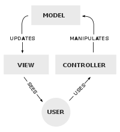
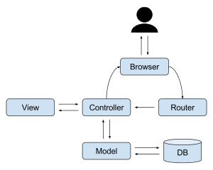
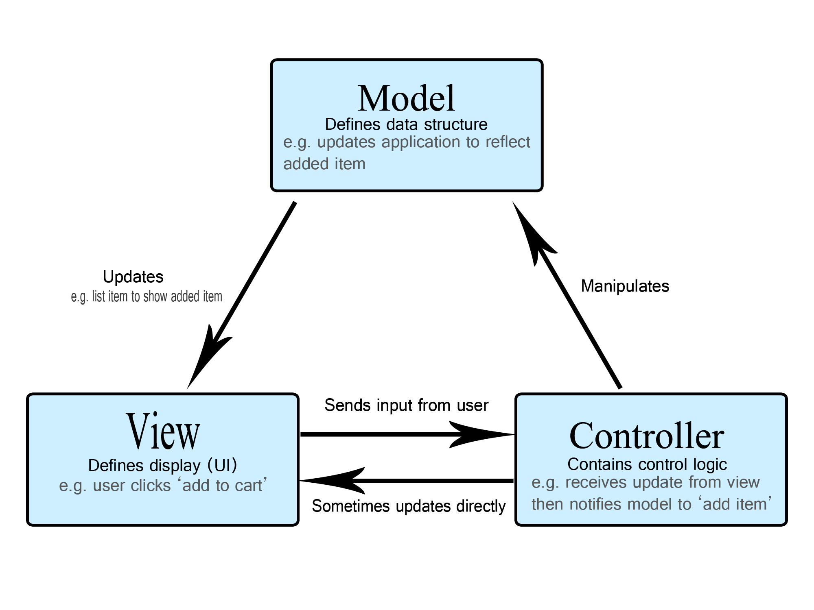
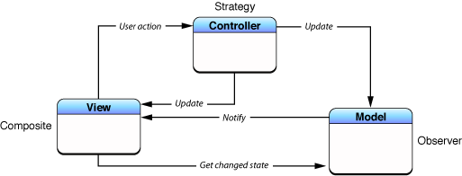
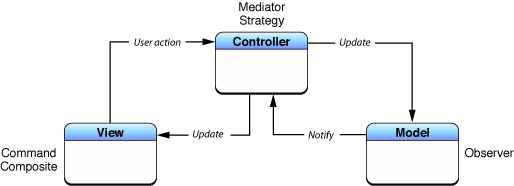
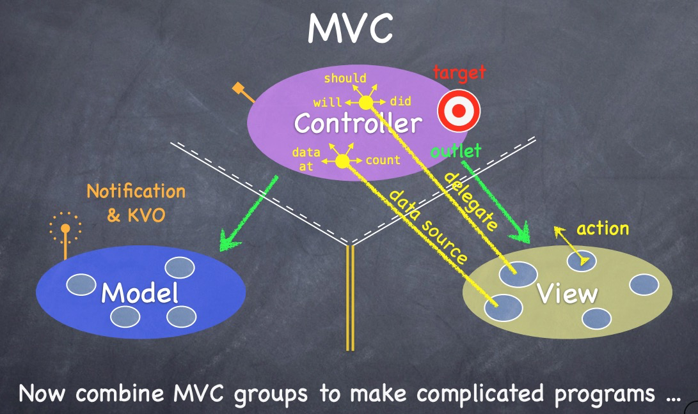

 

MVC의 개념을 정의하려고 검색을 해보면 정확하게 딱 이거다 하는 설명은 없다.

조금씩 설명하는 개념이 다르다.

그래서 먼저 MVC를 정확하게 이해한다기 보다는 컨셉과 왜 이 패턴이 나오게 되었는지 아는 것이 좋을 것 같다.

 

영어 위키피디아에 보면 역사가 나온다.

# MVC의 역사

- 79~80년도 한 연구소에서 대규모 SW를 개발 할 때 처음 등장한 개념.

- 88년도에 한 저널에 발표.

- 이후 웹 애플리케이션에서 자주 사용(Java String, Rudy on Rails), 점차 대중화 됨.

 

개발 초기부터 개발자들이 역할에 분리에 대한 필요성을 느껴서 나온 것 같다.

 

그래서 나는 다음과 같이 정의해보려고 한다.

# MVC란

객체지향 프로그램에서 사용자 인터페이스를 제공하는 프로그램을 개발할 때 각 객체들을 모델, 뷰, 컨트롤러로 나누고 이를 상호작용시키는 것을 말한다. 사용자에서 보여지는 부분과 데이터를 처리하는 부분을 나눠서 유지보수 하기 쉬게 하기 위한 것이 핵심이다.

 

# MVC의 관계

[//]: # (column_list is not supported)

	[//]: # (column is not supported)

		

	[//]: # (column is not supported)

		

		 

	[//]: # (column is not supported)

		

		 

MVC의 관계는 각 프레임워크 마다 정의하는 것이 조금씩 다르다.

애플은 이들을 전통적인 MVC라고 부르고 있다.

 

핵심은 모델과 뷰가 서로를 알고 있다는 것입니다. 

애플은 이것이 조금 깔끔하지 않았던 모양입니다.

애플은 조금 <u>**Cocoa MVC**</u> 라는 것을 정의합니다.

핵심은 뷰와 모델을 서로 모르게 하는 것이다. 애플은 이것을 조금 더 깔끔하다고 생각했던 것 같다.

 

스탠퍼스 강의 자료가 조금 더 그림으로 잘 표현하고 있다.

모델과 뷰 가운데 <u>노란 두 줄 선</u>이 있다. 이는 모델과 뷰는 서로를 직접 절대 알아서는 안되고, 모델이 업데이트 되었을 때는 옵셔버 패턴으로 다른 곳에 데이터가 변경 되었다는 것을 알려주기를 바라고 있다.

 

애플은 개발자들이 이렇게 개발하기를 의도하고 Cocoa 프레임워크를 만들었다.

 

## Cocoa Framework 에서의 View

- 사용자에게 보여지는 클래스를 추상화 한 것.

- 사실상 UIView를 상속받은 모든 클래스들.

 

## Cocoa Framework 에서의 Controller

- UIViewController를 상속 받는 모든 클래스

- AppDelegate, SceneDelegate.

 

## Cocoa Framework 에서의 Model

- 보통은 데이터를 담는 객체만을 말하는 경우도 많은데.. 뷰와 컨트롤러를 제외한 모든 객체라고 보는 것이 좋음.

- Codable을 채택한 것, URLSession, JsonDecoder, Extension으로 확장한 기능들 등등..

 

# 왜 iOS에서 MVC가 잘 지켜지지 않을까?

- UIViewController의 역할이 너무 많고 강력함.

- 모델과 뷰의 분리를 강제 하지 않음.

# 참고 자료

[https://www.notion.so/stevenkim18/MVC-019e79b62be747b4a0257bbad6d8a76b?pvs=4](https://www.notion.so/stevenkim18/MVC-019e79b62be747b4a0257bbad6d8a76b)

[https://developer.mozilla.org/ko/docs/Glossary/MVC](https://developer.mozilla.org/ko/docs/Glossary/MVC)

[https://ko.wikipedia.org/wiki/모델-뷰-컨트롤러](https://ko.wikipedia.org/wiki/%EB%AA%A8%EB%8D%B8-%EB%B7%B0-%EC%BB%A8%ED%8A%B8%EB%A1%A4%EB%9F%AC)

[https://web.stanford.edu/class/cs75n/1_MVC.pdf](https://web.stanford.edu/class/cs75n/1_MVC.pdf)

[https://medium.com/hcleedev/ios-개발-mvc-패턴과-uikit의-viewcontroller-3fdb52f6b4b8](https://medium.com/hcleedev/ios-%EA%B0%9C%EB%B0%9C-mvc-%ED%8C%A8%ED%84%B4%EA%B3%BC-uikit%EC%9D%98-viewcontroller-3fdb52f6b4b8)

[https://developer.apple.com/library/archive/documentation/General/Conceptual/DevPedia-CocoaCore/MVC.html](https://developer.apple.com/library/archive/documentation/General/Conceptual/DevPedia-CocoaCore/MVC.html)

[https://developer.apple.com/library/archive/documentation/General/Conceptual/CocoaEncyclopedia/Model-View-Controller/Model-View-Controller.html](https://developer.apple.com/library/archive/documentation/General/Conceptual/CocoaEncyclopedia/Model-View-Controller/Model-View-Controller.html)

[https://www.notion.so/stevenkim18/MVC-019e79b62be747b4a0257bbad6d8a76b?pvs=4](https://www.notion.so/stevenkim18/MVC-019e79b62be747b4a0257bbad6d8a76b)

