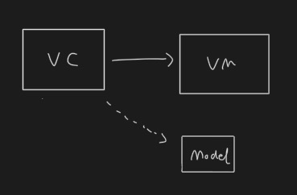
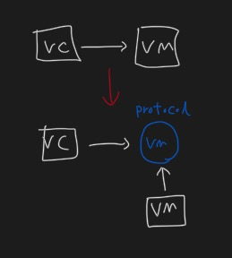

# DIP

- 의존성 역전의 원칙

- 상위 계층이 하위 계층에 의존하는 전통적인 의존관계를 역전시킴으로써 상위 계층이 하위 계층의 구현으로 부터 독립되게 할 수 있다.

	- 첫째, 상위 모듈은 하위 모듈에 의존해서는 안된다. 상위 모듈과 하위 모듈 모두 추상화에 의존해야 한다.

	- 둘째, 추상화는 세부 사항에 의존해서는 안된다. 세부사항이 추상화에 의존해야 한다.

<br/>

## 의존이란

- 사전적 정의: 어떠한 대상에 기대고 지지하게 되는 것. 다른 것을 의지하는 것.

<br/>

## 의존성

- 한개의 클래스가 다른 클래스의 파라미터, 리턴 값, 지역 변수등을 참조하는 것을 의미한다.

<br/>


```swift
class ViewController {
	let viewModel = ViewModel()
		
	func load(model: Model) {
		model.run()
	}
}

class ViewModel {

}

class Model {
	func run() {

	}
}
```



- 클래스 다이어그램에서 실선은 연관 관계, 점선은 의존 관계 → 하지만 <u>**둘 다 의존성**</u>

<br/>

> 상위 모듈이 하위 모듈을 의존해서는 안된다.

- 위 예시에 VC이 VM을 의존하고 있다.

- VC는 VM에 비해서 비교적 상위에 있다. 따라서 VC가 상위 모듈, VM이 하위 모듈이 될 수 있다.

<br/>

> 상위 모듈과 하위 모듈 모두 추상화에 의존해야 한다.

- 객체들은 모두 인터페이스(Swift의 경우 프로토콜)에 의존해야 한다.

<br/>

> 세부사항이 추상화에 의존해야 한다.

- 구현체(세부사항)인 클래스가 추상화 된 것(프로토콜 타입)에 의존해야 한다.

<br/>


```swift
class ViewController {
	let viewModel: ViewModelProtocol

	init (viewModel: ViewModelProtocol) {
		self.viewModel = viewModel
	}
		
	func load(model: Model) {
		model.run()
	}
}

protocol: ViewModelProtocol {

}

class ViewModel: ViewModelProtocol {

}
```

<br/>



- 원래는 상위 계층인 VC가 하위 계층인 VM을 의존하고 있었다.

- 의존성 역전의 원칙에 의해서 하위 계층의 VM이 **상위 계층인 VMProtocol을 의존**하게 되었다. 
→ VM 입장에서 의존성이 역전 된 것이다!

<br/>

## 참고

- [https://ko.wikipedia.org/wiki/SOLID_(객체_지향_설계)](https://ko.wikipedia.org/wiki/SOLID_(%EA%B0%9D%EC%B2%B4_%EC%A7%80%ED%96%A5_%EC%84%A4%EA%B3%84))

- [https://ko.wikipedia.org/wiki/의존관계_역전_원칙](https://ko.wikipedia.org/wiki/%EC%9D%98%EC%A1%B4%EA%B4%80%EA%B3%84_%EC%97%AD%EC%A0%84_%EC%9B%90%EC%B9%99)

- [https://dev-dain.tistory.com/264](https://dev-dain.tistory.com/264)

- [https://steady-coding.tistory.com/388](https://steady-coding.tistory.com/388)

- [https://blog.hexabrain.net/395](https://blog.hexabrain.net/395)

- [https://velog.io/@hoyaho/SOLID-원칙과-의존성-역전-원칙DIP-](https://velog.io/@hoyaho/SOLID-%EC%9B%90%EC%B9%99%EA%B3%BC-%EC%9D%98%EC%A1%B4%EC%84%B1-%EC%97%AD%EC%A0%84-%EC%9B%90%EC%B9%99DIP-)｜-Today-I-Learned

<br/>

<br/>

